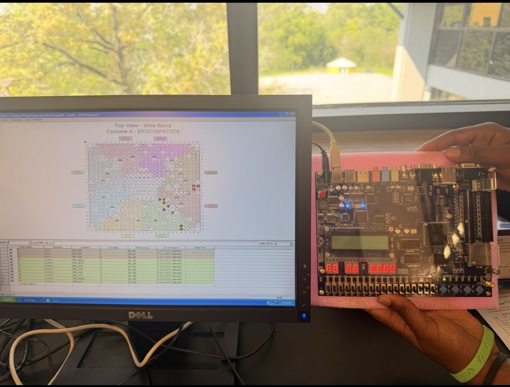

# VHDL 3-to-8 Decoder — FPGA Implementation (Quartus II)

**Course:** Digital Logic Design  
**Tools:** Quartus II, Altera DE2 Board (Cyclone II EP2C35F672C6), VHDL  

---

## Overview

This project implements a **3-to-8 line decoder** in VHDL, synthesized and deployed on an Altera DE2 FPGA development board. A 3-to-8 decoder takes a 3-bit binary input and activates exactly one of eight output lines corresponding to the input value — a fundamental building block in address decoding, memory selection, and digital control systems.

---

## VHDL Design

The design was written in Quartus II using the `ieee.std_logic_1164` library and compiled for the **Cyclone II EP2C35F672C6** FPGA, utilizing 8 logic cells.

```vhdl
Library ieee;
use ieee.std_logic_1164.ALL;

Entity aex81 IS
  port (
    I2, I1, I0 : In std_logic;
    Y0, Y1, Y2, Y3, Y4, Y5, Y6, Y7 : out std_logic
  );
End aex81;

Architecture arc of aex81 IS
Begin
  Y0 <= ((NOT I2) AND (NOT I1) AND (NOT I0));
  Y1 <= ((NOT I2) AND (NOT I1) AND I0);
  Y2 <= ((NOT I2) AND I1 AND (NOT I0));
  Y3 <= ((NOT I2) AND I1 AND I0);
  Y4 <= (I2 AND (NOT I1) AND (NOT I0));
  Y5 <= (I2 AND (NOT I1) AND I0);
  Y6 <= (I2 AND I1 AND (NOT I0));
  Y7 <= (I2 AND I1 AND I0);
END arc;
```
---

## Simulation

Functional simulation was run in Quartus II, generating waveforms for all input/output signals. The simulation confirmed correct one-hot output behavior across all 8 input combinations with **0 errors and 0 warnings**.


---
### How It Works
Each output `Y0`–`Y7` corresponds to one of the 8 possible 3-bit input combinations. Only the output matching the current binary input is driven high at any given time.

| I2 | I1 | I0 | Active Output |
|----|----|----|---------------|
| 0  | 0  | 0  | Y0 |
| 0  | 0  | 1  | Y1 |
| 0  | 1  | 0  | Y2 |
| 0  | 1  | 1  | Y3 |
| 1  | 0  | 0  | Y4 |
| 1  | 0  | 1  | Y5 |
| 1  | 1  | 0  | Y6 |
| 1  | 1  | 1  | Y7 |


## FPGA Hardware Deployment

The compiled design was loaded onto the **Altera DE2 development board** via the Quartus II programmer. Pin assignments were mapped using the Pin Planner for the Cyclone II chip, with inputs tied to onboard switches and outputs mapped to LEDs for visual verification.

  


---

## Resource Utilization

| Resource | Used |
|----------|------|
| Logic Cells | 8 / 8 (EP2C35F672C6) |
| Dedicated Logic | 0 |
| Compilation | ✅ Successful |
| Simulation | ✅ 0 errors, 0 warnings |

---

## Key Takeaways

- VHDL concurrent signal assignments map cleanly to combinational logic hardware
- Functional simulation in Quartus II is essential for verifying behavior before physical deployment
- Pin planning on the Cyclone II FPGA bridges the gap between HDL design and real hardware output

---
